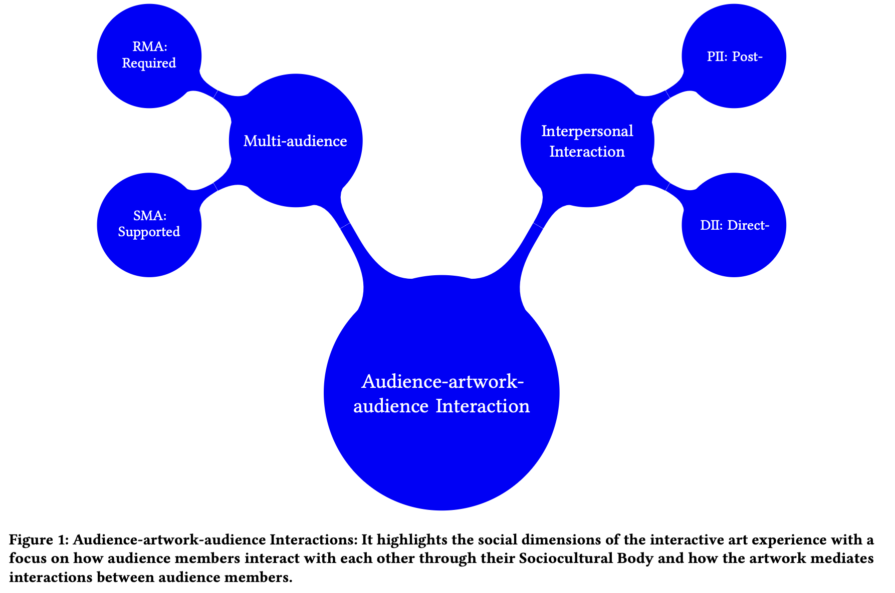
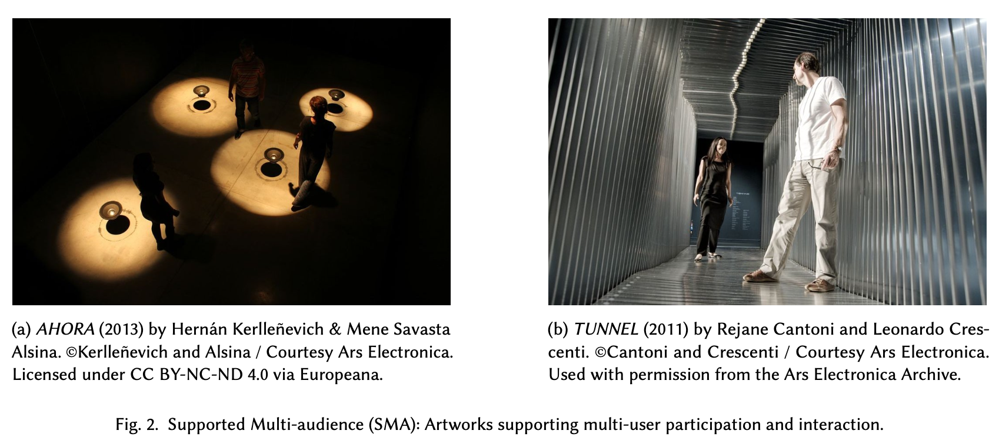
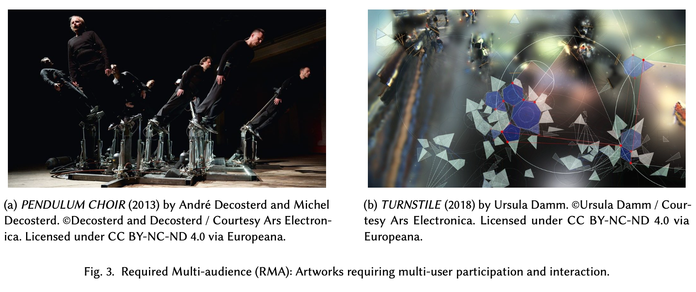
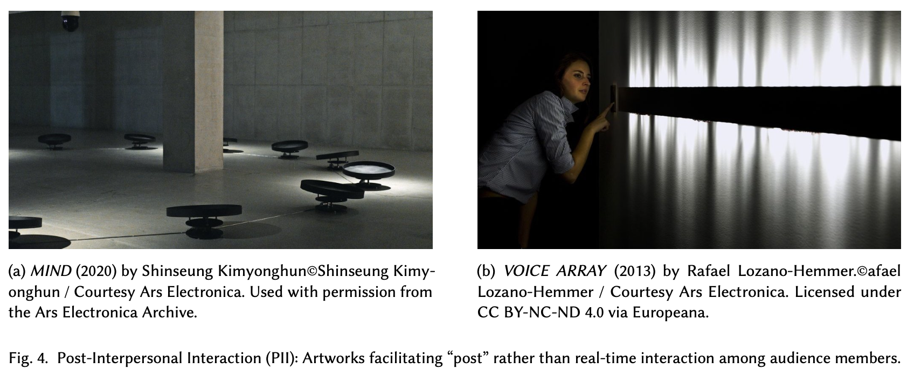
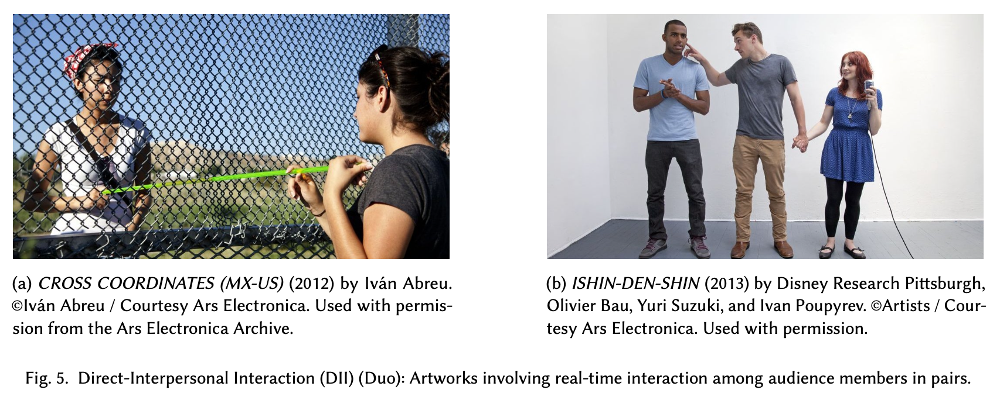
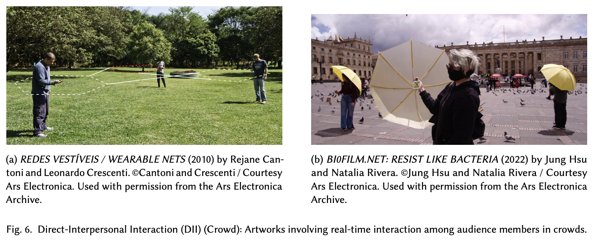

<!-- SLIDE 0 -->
<!-- .slide: data-background-color="#ffffff" -->
# **Towards Relationality**  
### Sociocultural Embodiment and Interpersonal Interaction  
##### By *Dr. [Aven-Le ZHOU](https://www.aven.cc)*, — ARTECH 2025

note: 

Hi everyone, I’m Aven. thanks everyone for being here. It’s such a pleasure to be here at ARTECH to present and discuss this paper entitled Towards Relationality: Sociocultural Embodiment and Interpersonal Interaction.

---

<!-- SLIDE 1 -->

## Aven-Le ZHOU

- **Assistant Professor, Design School**
    - *Xi'an Jiaotong-Liverpool University*
    - *University of Liverpool*

- **Ph.D. Computational Media and Arts**
    - *Hong Kong University of Science and Technology (Guangzhou)*
    - Practice-based PhD thesis *From Interactivity to Relationality: Becoming-with Relational Embodiment* August, 2025.

note: 

I recently finished my PhD research at Hong Kong University of Science and Technology, like literally very recently, I sucessfully defended my pratice-based PhD thesis entitled "From Interactivity to Relationality: Becoming-with Relatioal Embodiment" this summer. This paper also brrows many opinion and discussions from the first and second chapters of this thesis. 

I am now with Xi'an Jiaotong-Liverpool University as an assistant professor at our design school. 

---

<!-- SLIDE 2 -->
## **Overview**
- Introduction: Interaction in Interactive Art
- Theoretical foundations (**Sec.2**)
- Review of existing interactive art model (**Sec.3**)
- **Audience–Artwork–Audience model**<!-- .element: class="fragment grow highlight-current-red" --> (**Sec.4**)
- Ars Electronica case study (**Sec.5**)
- **Analysis, discussion & paradigm shift**<!-- .element: class="fragment grow highlight-current-red" --> (**Sec.6**)
- Conclusion & future work (**Sec.8-9**)

note:

Today I’m sharing this piece of research that revisits how we may better understand interaction in interactive art. Instead of treating interaction as something happening only between a person and a system or artwork, I’ll be talking about the relational side, how artworks mediate relationships among people.

Here’s the plan for today.

I’ll start with the role of interaction in interactive art, then introduce the theoretical foundations behind the shift I’m proposing. After that, I’ll review existing models of interactive art, highlight their limitations, and then introduce the Audience–Artwork–Audience model.

We’ll look at examples from the Ars Electronica archive, analyze the emerging patterns, and end with a discussion on where interactive art might be heading.

---

<!-- SLIDE 3 -->
## **Introduction**
#### Interaction in Interactive Art
- Interactive art = technological mediation + participation
- Sociocultural & relational dimensions remain underexplored
- Move beyond human–machine input/output
- Toward situated, embodied, relational experiences among audiences

note:

Interactive art is often described in a very straightforward way: the audience does something, and the artwork or the system responds. So the dominant framing is basically technological mediation plus participation. Or say, very narrowly, the interaction happens between the human body and the artwork. This is somewhat a powerful approach at the early development of interactive art, such as the very first ones, e.g., the videoplace by Myron Krueger, the first golden nica work of interactive art at Ars Electronica.

But this approach misses out a really important dimension — the sociocultural and relational dimensions of the body. People enter these installations with their habits, their cultural background, their social awareness, and their sense of other people around them. They don’t behave as isolated individuals triggering a machine. They shape each other’s experience. They respond to what others do — sometimes consciously, sometimes subconsciously.

So in this paper, I try to move beyond the typical human–machine input/output framing, and instead look at interaction as something situated, embodied, and relational — something that unfolds among audience members through the artwork. 

---

<!-- SLIDE 4 -->
## **Theoretical Grounding**
#### Interaction as socially and culturally embedded
- Phenomenology & post-phenomenology  
  *(Merleau-Ponty, Ihde)*
- Embodied interaction  
  *(Dourish: tangible + social computing)*

note:

to understand why we need to rethink interaction in this way, I want to briefly touch on the theoretical grounding that supports this shift.

Phenomenology, and later post-phenomenology, give us a useful foundation. Merleau-Ponty famously argues that the body is our primary way of being in the world. We don’t encounter the world as detached observers; we perceive and act through our embodied presence.

---

<!-- SLIDE 5 -->
## **Sociocultural Embodiment (Ihde)**
#### Three bodily dimensions:
- Phenomenal body  
- Sociocultural body  
- Techno-sociocultural body

note:

Don Ihde extends this into how technologies mediate our bodily experience. Technology doesn’t just extend our senses—it reshapes how we relate to the world and to each other. Whether it’s a VR headset or a simple sensor, there’s always mediation happening at the bodily level.

---

<!-- SLIDE 6 -->
## **Embodied Interaction (Dourish)**
- Tangible computing → body–technology coupling  
- Social computing → interaction embedded in context  
- Interaction is always situated

note:

Paul Dourish’s idea of embodied interaction resonates with a similar idea from HCI and social computing. Dourish reminds us that interaction is not just a technical process. It’s also cultural and social. Tangible computing connects our physical actions to computational outcomes, and social computing recognizes that all interaction happens within social context—norms, expectations, and the presence of others.

---

## **Theoretical Grounding**

- (Post)Phenomenology *(Merleau-Ponty, Ihde)*
- Embodied interaction  *(Dourish)*

**Interaction is always situated and socially and culturally embedded**<!-- .element: class="fragment grow highlight-current-red" -->

note:  

when we bring these together, we get a really important insight: interaction is always situated and socially embedded. It’s not just ‘body triggers system.’ It’s bodies acting and responding within cultural, social, and technological conditions. This becomes the theoretical basis for understanding interaction not only as human-to-system, but also as human-to-human through the artwork.

---

<!-- SLIDE 7 -->
## **Limits of Existing Models**
- System-centric, input/output focus  
- Interaction defined primarily as system responsiveness  
- Little attention to audience–audience dynamics  
- Sociocultural embodiment largely missing

note:

Before proposing the new model, I went through a fairly broad set of existing interactive art models and taxonomies — the classic ones from Cornock & Edmonds, to Dixon’s levels, to Kwastek’s categories, to the V2_ and Sparacino frameworks. I won’t go into each of them; What’s important is what they collectively center — and what they leave out.

Almost all of them are system-centric. They define interaction in terms of input and output, responsiveness, and system behavior. In other words, they describe how artworks react to what the audience does, but they don’t really talk about how audiences react to each other. And because of that, the sociocultural and interpersonal dimensions of interaction are largely missing. 

In other words, here the gap is: we have very detailed accounts of human–system/artwork dynamics, but we lack frameworks that help us understand audience–audience dynamics.

---

<!-- SLIDE 8 -->
## **Audience–Artwork–Audience Model**
Expands interactivity to:
- **Audience → Artwork → Audience**
- Focus on artwork-mediated interpersonality

note: 

I propose expanding it into a triadic relationship: Audience → Artwork → Audience. with this simple shift, it opens up a completely different way of looking at interactive art.

----

<!-- .slide: data-background-color="#ffffff" -->
#### **Audience–Artwork–Audience Model**

note:

with the new model, the artwork conditions the interperosnal encounter and their espond to each other. This shifting from interactivity to what I call interpersonality — highlights how the artwork foster the social, interpersonal space and actively mediated interpersonal engagements. 

---

<!-- SLIDE 9 -->
## **Core Proposition**
Interactive artworks can:
- Mediate **relations among audiences**
- Foster **interpersonal** & **collective** experience
- Become **relational mediators**, not just interfaces

note:

With this model, interactive artworks goes beyond somatic interfaces but becoming relational mediators. They bring people into shared experience. What matters is no longer ‘how the artwork reacts,’ but ‘how the artwork makes people react to each other.’ 

In other words, instead of defining interactive art primarily through system responsiveness, with this proposed model, I’m suggesting we define it through its capacity to foster interpersonal and collective experience.”

---

<!-- SLIDE 10 -->
#### **Interaction Categories Emerged**

note:

To further develop this model, I chose to work with the Ars Electronica archive — specifically the award-winning interactive art works; mainly becasue it’s a large and very accessible — it captures a significant portion or even full version of the history of interactive art, covering a wide variety of high-quality practices; all the works are amazingly archived with fully open accesses. And it naturally includes many works where audiences-artwork-audiences interaction happens.

When I examined these works through the Audience–Artwork–Audience model,
clear relational patterns began to emerge. These categories — SMA, RMA, PII, and DII — were not predefined. They emerged from observing how artworks structure interpersonal dynamics. It helps reveal how different works mediate audience–audience relationships, and it helps refine the overall model.

---

<!-- SLIDE 11 -->

## **Interaction Categories**
- **SMA** — Supported multi-audience  
- **RMA** — Required multi-audience  
- **PII** — Post-interpersonal  
- **DII** — Direct-interpersonal

note:

These categories help clarify different ways that artworks mediate audience–audience relations. In the next set of slides, I’ll walk through examples of each of these categories from Ars Electronica, so you can see how they operate in practice and how they support the Audience–Artwork–Audience model.”

---

<!-- SLIDE 12 -->
### **Supported Multi-Audience (SMA)**:

note:

We have — Supported Multi-Audience, where multiple people can interact at the same time, but their participation is not dependent on each other.

This describes works where multiple people can participate at the same time, but their actions don’t depend on each other. They’re co-present, but not necessarily co-dependent. We can think of this as a kind of ‘parallel participation.’ Everyone is interacting in the same space, and they may be aware of each other, but the artwork doesn’t force or require that.

---

<!-- SLIDE 13 -->
## **Required Multi-Audience (RMA)**:

note:

RMA — Required Multi-Audience, where the artwork actually needs multiple bodies to function properly — the interaction collapses without collective participation. In other words, the artwork is structurally collective.
It needs coordinated presence — not just optional co-presence like SMA, but actual interdependence.

We see works like Turnstile — the system visualizes collective movement patterns that simply don’t exist at the level of an individual. So RMA moves the participants from parallel participation into collective activation. People become aware of each other because the artwork requires them to be aware — the artistic experience won’t ‘complete’ unless multiple bodies are acting simultaneously.

---

<!-- SLIDE 14 -->
## **Post-Interpersonal Interaction (PII)**:

note:

PII — Post-Interpersonal Interaction, which is when people interact with traces left by others — so the relation is even through not synchronous but temperally-dependant and social.

In other words, participants interact with previous ones — their voices, movements, emotional states, data fragments - in the archive. The relationality happens across time, not in real time. This means the experience is shaped by people they've never met, and their presence will shape the experience of someone who arrives later. 

This temporal separation is very interesting to personally, several work of mine in my thesis echos this feature, because it expands relationality beyond co-presence. The artwork becomes a memory station — carrying affect, intention, or expression from one person to another.

---

<!-- SLIDE 15 -->
## **Direct-Interpersonal Interaction (DII)(Duo)**: 

note:

And DII — Direct-Interpersonal Interaction, which is when the artwork creates direct, real-time interpersonal engagement between participants.This takes us to the strongest, most straight-forward form of the audience–audience relationship. Here, the artwork creates real-time interpersonal engagement. Participants of these interactive artworks are directly influencing and responding to one another through the artwork. This happens through but limited to proximity, synchronized movement,  touch, or other shared embodied actions. The artwork becomes a mediating interface for relating.

----

### **Direct-Interpersonal Interaction (DII)(Crowd)**: 

note:

Instead of just ‘interacting with a system or artwork,’ participants are really encountering each other, with the system providing the technogical mediation to foster relational dynamics. Like these two exammple cases, relationality becomes really visible at the collective level: the crowd becomes dependant entities, depending on each other through the artwork. 

Whether it’s a duo or a full crowd, DII brings relationality to the forefront which makes interpersonal engagement the core of the interactive experience.

---

<!-- SLIDE 16 -->
## **Analysis**
- Artworks as relational mediators;  
- Technology fades out; relations foregrounded;  
- Collective & interpersonal experience is central;  
- Shifting toward relationality.

note:

In Section 6 of the paper, I analyze all the case studies together using the Audience–Artwork–Audience model, and a few consistent patterns become very clear.

First, across the examples, the artwork increasingly behaves as a relational mediator. The system isn’t just reacting to individuals — it’s structuring how people experience one another. Second, as this relationality strengthens, the technology itself tends to fade into the background. It becomes the underlying infrastructure, while the interpersonal dynamics rise to the surface as the main experience. Third, what becomes central is the collective and interpersonal dimension of interaction. The meaning, the intensity, the affective quality are all shaped by the audience–audience relations, not just audience–artwork relations.

The analysis shows a clear shift away from system responsiveness or human-artwork interativity, toward an understanding of interactive art as staging sociocultural, collective and relational experiences.

---

<!-- SLIDE 17 -->

<!-- .slide: data-background-color="#ffffff" -->

#### **Paradigm Shift**

note:

Here is how I summarize this paradigm shift:

Interactivity, in the traditional sense, focuses on the relationship between a human and an artwork kind of model. This is where most early and even contemporary discussions of interactive art still begin: sensors, inputs, feedback, system responsiveness.

Interpersonality marks the shift when the system begins mediating relationships between audiences. The artwork is no longer the sole counterpart. Instead, the artwork mediates and shapes how people perceive, respond to, and coordinate with one another.

This is the moment when interaction becomes socially structured rather than merely somatic or technical. Again, the artwork moves from being an interactive interface to becoming an interpersonal interface.

---

<!-- SLIDE 18 -->
## **(Early) Conclusion**
- Beyond human–machine binaries  
- Artworks as relational mediators  
- Emphasis on sociocultural embodiment

note:

So to conclude — the main message of the paper is that interactive art can be understood as a relational practice rather than simply a technological one. By highlighting sociocultural embodiment, it recognize that participants bring interpersonal relationships into the artwork. 

This way, interactive artworks are no longer interfaces responding to individual inputs. They are relational mediators that stage relational experience. This gives us a richer and more dynamic way of understanding what contemporary interactive artworks may head to.

---

<!-- SLIDE 19 -->
## But! Limitations
- Anthropocentric focus  
- Mostly co-located interaction  

note: 

One clear limitation is that the current model is still anthropocentric.
It focuses on human-to-human relationships and doesn’t yet address interaction with nonhuman actors — whether plants, animals, environments, ecology, planet, or autonomous artificial systems. Another limitation is that this research mostly examines co-located interaction — situations where people share the same physical space.

---

<!-- SLIDE 20 -->
## Future Work

- Include nonhuman/interspecific relations  
- Broader social and socio-political systems

note:

One direction is to extend relationality beyond the human — toward interspecific interaction, nonhuman agencies, and ecological relationality.
This means exploring how interactive artworks might mediate relations between humans and more-than-human actors; this is also what i am working on after my PhD.

Another direction is to scale up relationality into broader social and political systems. and thinking about relationality operating across communities, infrastructures, and / or planetary conditions.

---

<!-- SLIDE 21 -->

#### **And I am More into**<!-- .element: class="fragment grow highlight-current-red" -->

note:

And of course, this is another manuscript i am working on:

Building on interpersonality, Relationality expands the focus beyond direct interpersonal dynamics. Relationality does not replace or overwrite interactivity or interpersonality. Instead, it reframes them within a wider ecology of relationships, where the artwork is just one actor among many or as how we previously defined - mediator.

Under this perspective, interaction is no longer understood as something happening between “a body and an artwork,” but as something unfolding within a relational field — bodily, technological, sociocultural, ecological, and even planetary and as a way of participating in larger nexus of entanglements.

---

## Thank You

#### *Dr. [Aven-Le ZHOU](https://www.aven.cc)*
#### *aven.le.zhou@gmail.com*
##### *#avenlezhou* 
##### @linkedin (Updated occasionally)
##### @instagram(rarely updated)*
